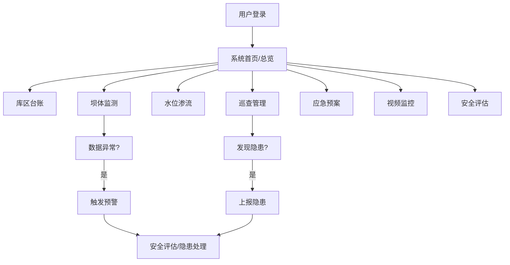

## 1. 产品概述

矿山尾矿库安全监测Web系统是一套面向矿业企业的专业安全管理平台，用于实现尾矿库全生命周期的数字化、智能化安全管控。系统整合库区台账管理、坝体安全监测、水位渗流监测、巡查管理、应急预案、视频监控和安全评估七大核心功能模块，帮助矿企实时掌握尾矿库运行状态，及时发现安全隐患，防范溃坝等重大安全事故。

- 目标用户：矿业企业安全管理人员、技术工程师、监管部门人员
- 产品价值：提升尾矿库安全管理水平，降低安全风险，满足监管要求

## 2. 核心功能

### 2.1 用户角色

| 角色 | 说明 | 核心权限 |
|------|------|----------|
| 系统管理员 | 系统超级用户 | 全部功能、用户管理、系统配置 |
| 安全管理人员 | 企业安全部门人员 | 数据查看、巡查登记、预案管理、预警处理 |
| 技术工程师 | 监测技术人员 | 监测数据查看、设备管理、数据分析 |
| 监管人员 | 政府监管部门 | 数据查看、安全评估、报表导出 |

### 2.2 功能模块

1. **库区台账**：尾矿库基础档案、基本信息管理、设计参数、库容曲线
2. **坝体监测**：坝体位移监测、沉降监测、数据趋势分析
3. **水位渗流**：浸润线水位监测、渗流量监测、降雨量监测、干滩长度监测
4. **巡查管理**：人工巡查打卡、巡查记录、排洪设施检查、隐患上报
5. **应急预案**：溃坝应急预案、应急资源、疏散路线、演练记录
6. **视频监控**：库区实时视频、摄像头管理、视频回放
7. **安全评估**：安全度等级评估、监测预警、风险分析、报表统计

### 2.3 页面详情

| 页面名称 | 模块名称 | 功能描述 |
|----------|----------|----------|
| 库区台账 | 基础档案 | 展示尾矿库名称、位置、建设时间、设计单位、库容、坝高等基础信息 |
| 库区台账 | 设计参数 | 展示坝型、设计坝高、总库容、调洪库容、防洪标准等技术参数 |
| 库区台账 | 库容曲线 | 可视化展示水位-库容关系曲线 |
| 坝体监测 | 位移监测 | 展示坝体水平/垂直位移监测点实时数据、变化趋势图表 |
| 坝体监测 | 沉降监测 | 展示坝体各断面沉降数据、累计沉降量分析 |
| 坝体监测 | 数据对比 | 多测点数据对比、异常值标识 |
| 水位渗流 | 浸润线监测 | 展示各监测断面浸润线水位、埋深数据及趋势图 |
| 水位渗流 | 渗流量监测 | 展示渗流量实时数据、日/月累计渗流量统计 |
| 水位渗流 | 降雨量监测 | 展示库区降雨量实时数据、历史统计、暴雨预警 |
| 水位渗流 | 干滩长度 | 展示干滩长度实时监测数据、最小干滩长度预警 |
| 巡查管理 | 巡查打卡 | 巡查人员定位打卡、巡查路线、巡查点 |
| 巡查管理 | 巡查记录 | 巡查记录列表、详情查看、问题描述与照片 |
| 巡查管理 | 排洪设施检查 | 排洪隧洞、溢洪道等设施检查记录 |
| 巡查管理 | 隐患管理 | 隐患上报、整改跟踪、闭环管理 |
| 应急预案 | 预案管理 | 溃坝应急预案文本、版本管理 |
| 应急预案 | 应急资源 | 应急物资、设备、人员清单 |
| 应急预案 | 疏散路线 | 周边居民疏散路线图、安置点信息 |
| 应急预案 | 演练记录 | 应急演练计划、记录、评估 |
| 视频监控 | 实时监控 | 多路视频实时播放、画面切换 |
| 视频监控 | 摄像头管理 | 摄像头列表、在线状态、位置分布 |
| 视频监控 | 视频回放 | 历史视频检索与回放 |
| 安全评估 | 安全度评级 | 尾矿库安全度等级（正常库/病库/险库/危库）评估结果 |
| 安全评估 | 监测预警 | 预警信息列表、预警等级、处理状态 |
| 安全评估 | 风险分析 | 综合风险评估、风险矩阵展示 |
| 安全评估 | 报表统计 | 各类监测数据统计报表、导出功能 |

## 3. 核心流程

用户登录系统后，通过左侧导航栏进入各功能模块。核心业务流程包括：

1. 日常监测流程：查看实时监测数据 → 识别异常数据 → 触发预警 → 隐患排查 → 整改闭环
2. 安全巡查流程：制定巡查计划 → 现场巡查打卡 → 记录巡查情况 → 上报发现问题 → 跟踪整改
3. 应急响应流程：预警触发 → 启动应急预案 → 调度应急资源 → 组织疏散 → 事后评估

## 4. 用户界面设计

### 4.1 设计风格
- 主色调：工业蓝 `#1e40af` 作为主色，搭配深灰 `#1e293b` 背景
- 辅助色：安全红 `#dc2626`（预警）、警告橙 `#f59e0b`、正常绿 `#16a34a`
- 整体风格：专业工业监控风格，深色主题，数据可视化突出
- 布局：左侧导航栏 + 顶部状态栏 + 主内容区
- 字体：使用现代无衬线字体，数据展示强调清晰可读
- 图标：使用线性图标风格，简洁专业

### 4.2 页面设计概览

| 页面名称 | 模块名称 | UI元素 |
|----------|----------|--------|
| 库区台账 | 基础档案 | 信息卡片、标签页、参数表格 |
| 坝体监测 | 位移/沉降监测 | 数据卡片、折线图、测点分布示意图 |
| 水位渗流 | 浸润线/渗流 | 仪表盘、趋势图、数据表格、告警标识 |
| 巡查管理 | 巡查打卡 | 地图组件、打卡记录、时间线 |
| 应急预案 | 预案管理 | 文档阅读器、资源列表、地图标注 |
| 视频监控 | 实时监控 | 视频网格布局、播放器控件、状态指示灯 |
| 安全评估 | 预警评估 | 预警列表、风险矩阵图、等级指示器、统计图表 |

### 4.3 响应式
- 采用桌面端优先设计，适配1920×1080及以上分辨率
- 侧边栏可折叠，适配不同屏幕宽度
- 数据表格支持横向滚动

### 4.4 视觉特色
- 深色主题，降低长时间监控的视觉疲劳
- 数据卡片采用微发光效果，突出关键指标
- 预警信息采用动态闪烁效果，吸引注意力
- 图表采用渐变填充和动画效果，提升视觉体验
