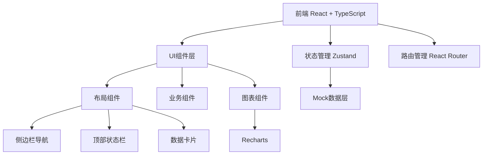

## 1. 架构设计



## 2. 技术说明

- 前端框架：React@18 + TypeScript
- 构建工具：Vite
- 样式方案：Tailwind CSS 3
- 路由管理：react-router-dom@6
- 状态管理：zustand
- 图表库：recharts
- 图标库：lucide-react
- 后端：无（纯前端项目，使用Mock数据）
- 数据：本地Mock数据模拟

## 3. 路由定义

| 路由路径 | 页面名称 | 说明 |
|----------|----------|------|
| /dashboard | 系统总览 | 首页总览，关键指标展示 |
| /reservoir | 库区台账 | 尾矿库基础档案管理 |
| /dam-monitoring | 坝体监测 | 坝体位移沉降监测 |
| /seepage | 水位渗流 | 浸润线、渗流量、降雨量、干滩监测 |
| /patrol | 巡查管理 | 巡查打卡、排洪设施检查 |
| /emergency | 应急预案 | 溃坝应急预案管理 |
| /video | 视频监控 | 库区视频监控 |
| /assessment | 安全评估 | 安全度等级评估与预警 |

## 4. 数据模型

### 4.1 核心数据类型定义

```typescript
// 尾矿库基础信息
interface ReservoirInfo {
  id: string;
  name: string;
  location: string;
  buildDate: string;
  designCompany: string;
  totalCapacity: number; // 总库容(万m³)
  damHeight: number; // 坝高(m)
  damType: string; // 坝型
  floodStandard: string; // 防洪标准
  status: 'normal' | 'warning' | 'danger';
}

// 监测点数据
interface MonitoringPoint {
  id: string;
  name: string;
  section: string; // 断面
  type: 'displacement' | 'settlement' | 'phreatic' | 'seepage' | 'rainfall' | 'beach';
  value: number;
  unit: string;
  threshold: { warning: number; danger: number };
  status: 'normal' | 'warning' | 'danger';
  timestamp: string;
  history: { time: string; value: number }[];
}

// 巡查记录
interface PatrolRecord {
  id: string;
  inspector: string;
  patrolTime: string;
  location: string;
  checkItems: string[];
  issues: string;
  photos: string[];
  status: 'normal' | 'issue_found' | 'rectified';
}

// 预警信息
interface Alert {
  id: string;
  type: 'dam' | 'seepage' | 'rainfall' | 'patrol';
  level: 'info' | 'warning' | 'danger';
  title: string;
  description: string;
  time: string;
  status: 'pending' | 'processing' | 'resolved';
  handler?: string;
}

// 摄像头
interface Camera {
  id: string;
  name: string;
  location: string;
  status: 'online' | 'offline';
  thumbnail: string;
}
```

## 5. 项目目录结构

```
src/
├── components/          # 通用组件
│   ├── layout/         # 布局组件
│   │   ├── Sidebar.tsx
│   │   ├── Header.tsx
│   │   └── Layout.tsx
│   ├── common/         # 公共UI组件
│   │   ├── StatCard.tsx
│   │   ├── StatusBadge.tsx
│   │   ├── DataTable.tsx
│   │   └── AlertList.tsx
│   └── charts/         # 图表组件
│       ├── LineChart.tsx
│       ├── GaugeChart.tsx
│       └── AreaChart.tsx
├── pages/              # 页面组件
│   ├── Dashboard.tsx
│   ├── Reservoir.tsx
│   ├── DamMonitoring.tsx
│   ├── Seepage.tsx
│   ├── Patrol.tsx
│   ├── Emergency.tsx
│   ├── VideoMonitor.tsx
│   └── Assessment.tsx
├── store/              # 状态管理
│   └── useStore.ts
├── data/               # Mock数据
│   └── mockData.ts
├── types/              # TypeScript类型定义
│   └── index.ts
├── utils/              # 工具函数
│   └── format.ts
├── App.tsx
├── main.tsx
└── index.css
```
